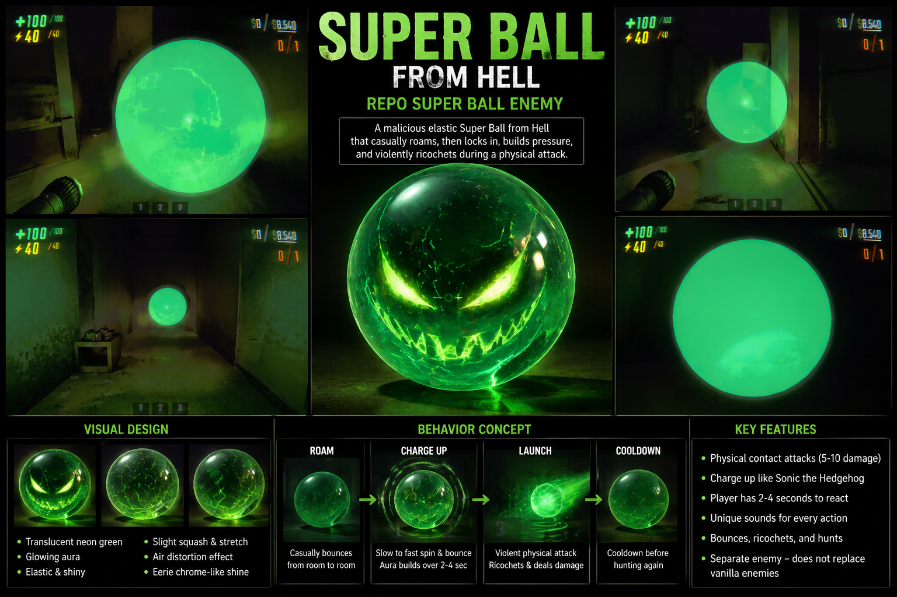

# REPO Super Ball Anomaly

Experimental BepInEx/REPOLib mod for R.E.P.O. that adds a test-spawnable neon green "Super Ball Anomaly" enemy.

> Status: Prototype / v0.3.1 plus Unity-authored internal VFX iteration

## Super Ball From Hell

> One Man, One Orb, Thirty-Seven Shader Passes, and a Dream.

A custom R.E.P.O. enemy mod featuring a translucent neon-green super ball with internal cracks, energy veins, sinister face projection, glowing aura, charge-up behavior, and violent ricochet attacks.



## Features

- `F8` test spawn for host/single-player testing.
- Runtime-created wet, shiny emerald-black pearl shell instead of a ghost orb.
- Concept-style charge-only internal demonic face with acid yellow-green eyes, a wide grin, teeth, internal crack veins, dark core, chrome-like highlight decals, and fake reflective rim/highlight layers.
- Unity-authored internal cracks now use wider procedural yellow-green coverage across the visible inner shell instead of small hand-placed cube cracks.
- Unity-authored internal energy veins add 32 angular, state-synced LineRenderer paths inside the InnerCore shell, with subtle idle visibility, stronger charge visibility, and an intense launch flash.
- `SuperBallInternalVeins` keeps `ManualShellRadius` active at `0.98`, generates at an effective radius of `0.965`, and validates that the widest generated line stays under the shell surface.
- Energy vein material/shader source is included in the Unity project as `M_SuperBall_EnergyVeins.mat` and `Shaders/SuperBallEnergyVein.shader`.
- Default sphere diameter of `0.55m`.
- Custom `IdleRoam -> ChargeWarning -> ChargeLaunch -> Recovery` behavior scaffold.
- Roams between level points when available using collision-predicted short steps, then physically launches and ricochets.
- Charge warning ramps bounce, spin, size growth, face intensity, lightning, glow, and aura from slow to fast.
- Multi-shell translucent aura provides a softer fake displaced-air/pressure effect.
- Procedural green/yellow lightning arcs stay hidden in idle/recovery and appear late in charge, during launch, and on ricochet bursts.
- Sound hook log points are present for idle bounce, charge hum, face activation, launch, ricochet, lightning, and recovery moments.
- Inherited colliders are disabled so the active collider set is minimal and intentional.
- Inherited base enemy renderers are disabled so Animal parts should not show.
- Suspicious inherited Animal/zap/ranged attack scripts are disabled by default.
- Physical blocking sphere collider is enabled by default for v0.2 testing.
- Clones `Animal` AI if available, with a fallback to the closest chase-style enemy if not.
- Spawn pool injection is disabled by default.
- Does not replace or delete vanilla enemies.

`v0.3.1` focuses on making the enemy read as a wet reflective emerald-black cursed super ball: darker pearl core, clearer charge face/teeth, hidden-idle lightning, softer aura, floor-safe ricochet filtering, stronger roam bounce, and more obvious charge growth. Natural spawning will come later after the behavior is stable.

## Requirements

- R.E.P.O.
- BepInEx
- REPOLib
- .NET SDK capable of building `net48`

The project references local game and modding assemblies from your own R.E.P.O. install. Those DLLs are required to build locally, but they are not included in this repository.

## Build / Deploy Summary

Default local game path used by the project:

```text
D:\SteamLibrary\steamapps\common\REPO
```

Build and deploy from PowerShell:

```powershell
cd 'C:\MSSA Code-github\REPO_SuperBallEnemy'
.\BuildAndDeploy.ps1
```

Manual build:

```powershell
dotnet build 'C:\MSSA Code-github\REPO_SuperBallEnemy\Plugin\RepoSuperBallEnemy\RepoSuperBallEnemy.csproj'
```

Manual deploy target:

```text
D:\SteamLibrary\steamapps\common\REPO\BepInEx\plugins\RepoSuperBallEnemy\RepoSuperBallEnemy.dll
```

No asset bundle is required for `v0.3.1`; the shipped plugin visual is still generated at runtime. The Unity project is included as source for authored crack/vein iteration and future asset-bundle work.

## Testing Steps

1. Build the plugin.
2. Deploy `RepoSuperBallEnemy.dll` to `BepInEx\plugins\RepoSuperBallEnemy\`.
3. Launch R.E.P.O.
4. Start or host a single-player/hosted level.
5. Press `F8`.
6. Check `BepInEx\LogOutput.log`.

Expected log messages include:

```text
REPO Super Ball Enemy 0.3.1 loaded.
Selected base enemy ...
Registered Super Ball ...
Super Ball wet material setup ...
Super Ball aura field created ...
Super Ball lightning system created ...
Concept visual setup: faceEnabled=True ...
Super Ball test spawn requested ...
F8 spawn diagnostics ...
Super Ball roam target chosen ...
Super Ball blocked movement detected ...
Super Ball stuck recovery triggered ...
Super Ball charge warning started.
Super Ball chargeProgress 0.25 ...
Super Ball face activated ...
Super Ball face renderers active ...
Super Ball lightning enabled ...
Super Ball charge cast hit object ... acceptedAsWallRicochet=False
Super Ball charge launch started.
Super Ball ricochet ...
Super Ball ricochet lightning burst.
```

## Config

After first launch, BepInEx should generate:

```text
BepInEx\config\James.RepoSuperBallEnemy.cfg
```

Useful entries:

```text
EnableSuperBall = true
SuperBallDiameter = 0.55
SpawnTestKey = F8
EnableSpawnPoolInjection = false
MainEmission = 1.75
MainAlpha = 0.55
ReflectiveSmoothness = 1
ReflectiveMetallic = 0.35
InnerGlowAlpha = 0.55
InnerCoreColor = #00180A
EnableConceptFace = true
EnableInternalCracks = true
EnableChromeHighlights = true
FaceEnabled = true
FaceAppearAtChargeProgress = 0.25
FaceEmissionMin = 1
FaceEmissionMax = 6
FaceEyeColor = #DFFF2A
FaceMouthColor = #F3FF78
FaceTeethEnabled = true
FaceMaxAlpha = 0.95
FaceScale = 1
CrackGlowIntensity = 4.75
CrackLayerAlpha = 0.72
InnerCoreAlpha = 0.55
AuraEnabled = true
AuraIdleAlpha = 0
AuraChargeAlpha = 0.12
AuraPulseSpeedMin = 1
AuraPulseSpeedMax = 7
AuraMaxScale = 1.45
DisableHardAuraShell = true
EnableBounceVisuals = true
SpawnDistance = 4
EnableFallbackDebugSphere = true
EnablePhysicalBlockingCollider = true
DisableInheritedBaseAttacks = true
EnableCustomSuperBallBehavior = true
ContactDamage = 5
ChargedDamage = 10
RoamSpeed = 2
RoamBounceHeight = 0.22
RoamBounceFrequency = 2.1
ChargeWarningDuration = 3
ChargeCooldownSeconds = 5
ChargeBounceHeight = 0.28
ChargeBounceFrequency = 4
ElasticSquashAmount = 0.18
ChargeSpinSpeedMin = 120
ChargeSpinSpeedMax = 1320
ChargeSpeed = 9.5
MaxRicochetCount = 3
RecoveryDuration = 1.25
ChargeAuraScale = 2.25
ChargeScaleMultiplier = 1.75
ChargeScaleCurvePower = 1.6
LightningEnabled = true
LightningArcCount = 4
LightningDuringChargeProgress = 0.70
LightningEmission = 4
LightningIdleVisible = false
LightningThickness = 0.018
LightningJitter = 0.18
LightningRefreshRate = 0.07
```

Keep `EnableSpawnPoolInjection = false` until the controlled `F8` test spawn is confirmed working.

## Known Limitations

- The authored Unity scene now includes internal cracks and energy veins, but runtime asset-bundle integration is not wired yet.
- Room-to-room roaming is heuristic and uses level points/navmesh sampling where available.
- Physical launch damage is not applied yet.
- The current plugin still uses runtime primitive spheres/quads/textures/line renderers for `v0.3.1`.
- Spawn pool integration is disabled by default.
- Requires local game DLL references to build.
- Player damage is not wired yet. Contact currently logs the intended damage amount.
- Real custom audio clips are not added yet. Sound events are scaffolded as throttled log hooks.

## Unity / Asset Bundle Notes

The local game install appears to use Unity:

```text
2022.3.67f2
```

The included Unity project currently targets:

```text
2022.3.62f3
```

The Unity scene now contains authored internal crack and vein systems for visual iteration. The current GitHub repo remains source-only: no game DLLs, built plugin DLLs, Unity `Library`, or generated asset bundles are included.

## Safety Note

This repository does not include R.E.P.O. game files or third-party DLLs. It contains source code, project files, documentation, and helper scripts only.
